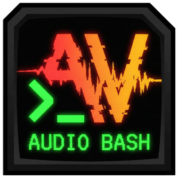

# AudioBash



A voice-controlled terminal for developers. Speak commands, execute them instantly.

## Features

- **Voice-to-terminal** - Speak naturally and have your words transcribed directly into the terminal
- **Multi-tab support** - Run up to 4 terminal sessions simultaneously
- **Multiple AI providers** - Gemini 2.0/2.5 Flash, OpenAI Whisper, or local transcription
- **Auto-copy** - Selected text is automatically copied to clipboard
- **Always-on-top mode** - Pin the voice panel while you work
- **Visual themes** - Multiple color themes to match your style
- **System tray** - Runs quietly in background, accessible via global shortcuts

## Installation

Download the latest installer from [Releases](https://github.com/jamditis/audiobash/releases).

Or build from source:

```bash
git clone https://github.com/jamditis/audiobash.git
cd audiobash
npm install
npm run electron:build
```

## Usage

1. **Launch AudioBash** - The app starts with a PowerShell terminal
2. **Press Alt+S** - Opens the voice panel and starts recording
3. **Speak your command** - e.g., "list all files in the current directory"
4. **Release Alt+S** - Transcription is sent to the terminal

### Keyboard shortcuts

| Shortcut | Action |
|----------|--------|
| `Alt+S` | Toggle voice recording |
| `Alt+H` | Show/hide window |

### Voice panel modes

- **Auto-send** - Automatically execute transcribed commands (toggle in settings)
- **Pin mode** - Keep voice panel open while working

## Configuration

Open Settings (gear icon in title bar) to configure:

- **API Keys** - Add keys for Gemini, OpenAI, Anthropic, or ElevenLabs
- **Transcription model** - Choose between cloud or local transcription
- **Default shell** - PowerShell, CMD, or Bash
- **Visual theme** - Select from multiple color schemes
- **Scanlines** - Enable retro CRT effect

### Getting API keys

- **Gemini** (recommended): [Google AI Studio](https://aistudio.google.com/app/apikey)
- **OpenAI**: [OpenAI Platform](https://platform.openai.com/api-keys)
- **Anthropic**: [Anthropic Console](https://console.anthropic.com/settings/keys)

## Tech stack

- **Electron** - Desktop application framework
- **React 19** - UI framework
- **TypeScript** - Type-safe JavaScript
- **xterm.js** - Terminal emulator
- **node-pty** - Pseudoterminal bindings
- **Tailwind CSS** - Styling
- **Vite** - Build tool

## Development

```bash
# Install dependencies
npm install

# Run in development mode
npm run electron:dev

# Build for production
npm run electron:build
```

## License

MIT

## Author

Joe Amditis ([@jamditis](https://github.com/jamditis))
