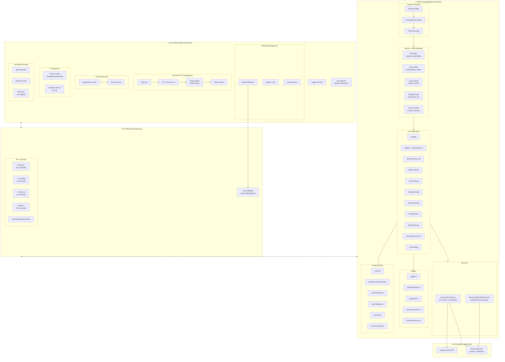
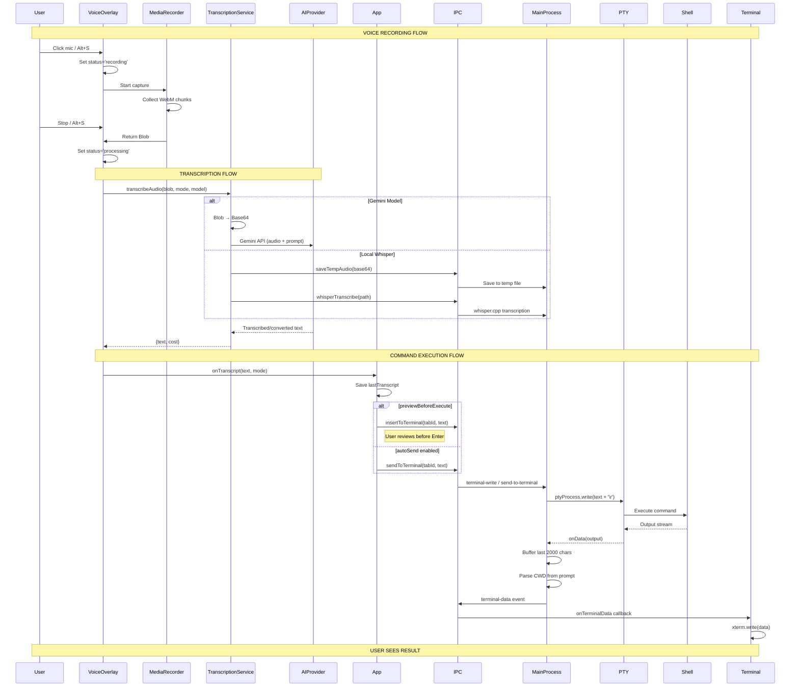
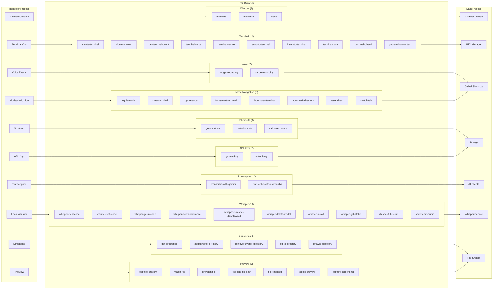
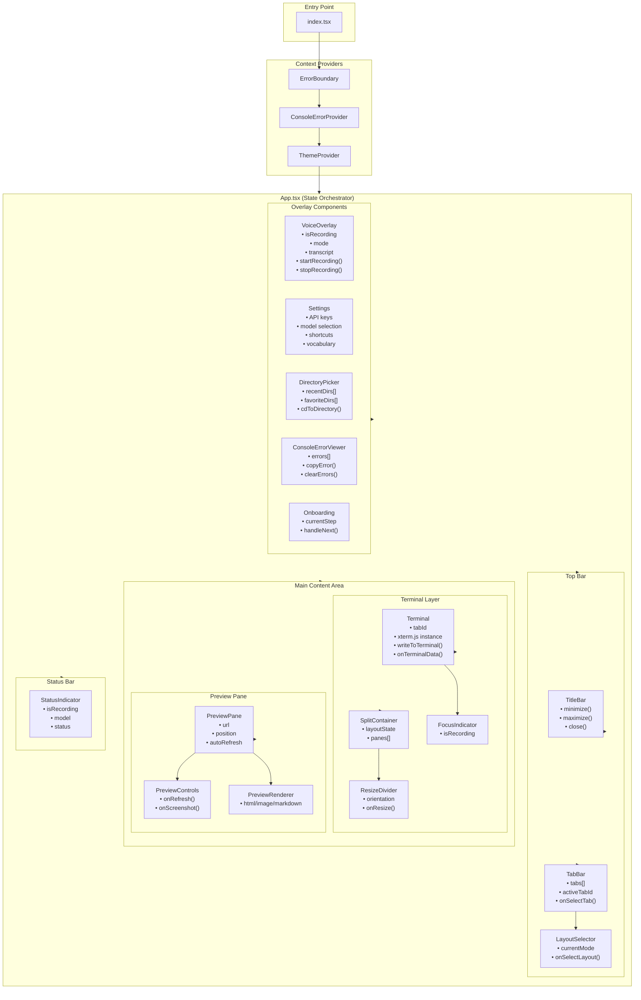
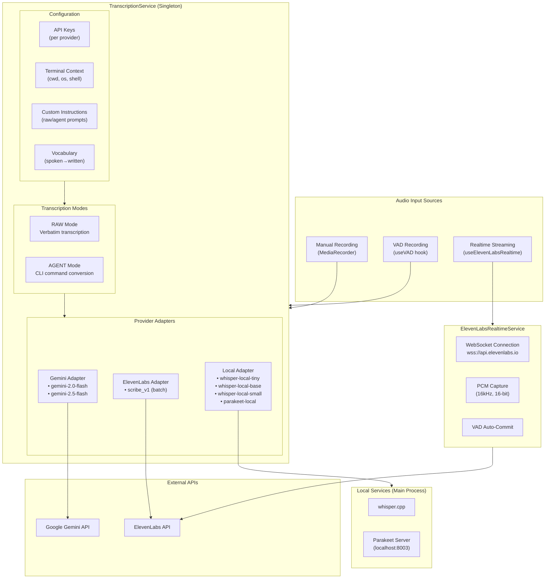
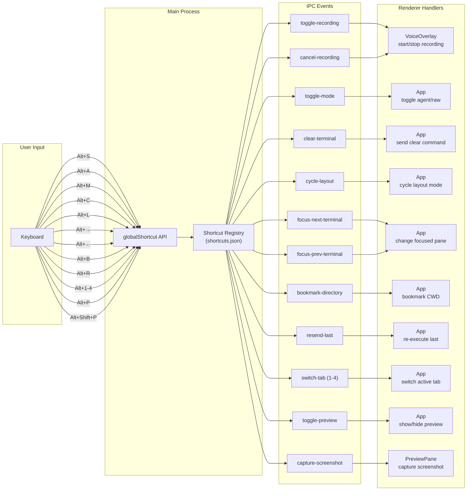

# AudioBash System Architecture

> **Complete Visual Map of All Processes, Components, and Data Flows**

---

## Master Architecture Overview

```
┌─────────────────────────────────────────────────────────────────────────────────────────┐
│                              AUDIOBASH ARCHITECTURE                                      │
│                         Voice-Controlled Terminal for Claude Code                        │
├─────────────────────────────────────────────────────────────────────────────────────────┤
│                                                                                         │
│  ┌─────────────────────────────────────────────────────────────────────────────────┐   │
│  │                           ELECTRON MAIN PROCESS                                  │   │
│  │                            (electron/main.cjs)                                   │   │
│  │  ┌─────────────┐ ┌─────────────┐ ┌─────────────┐ ┌─────────────┐               │   │
│  │  │   Window    │ │    PTY      │ │   Global    │ │   System    │               │   │
│  │  │  Manager    │ │  Manager    │ │  Shortcuts  │ │    Tray     │               │   │
│  │  └─────────────┘ └─────────────┘ └─────────────┘ └─────────────┘               │   │
│  │  ┌─────────────┐ ┌─────────────┐                                               │   │
│  │  │   Whisper   │ │     AI      │                                               │   │
│  │  │   Service   │ │   Clients   │                                               │   │
│  │  │  (Local)    │ │(Gemini/OAI) │                                               │   │
│  │  └─────────────┘ └─────────────┘                                               │   │
│  │  ┌─────────────┐ ┌─────────────┐ ┌─────────────┐                               │   │
│  │  │    File     │ │  Persistent │ │   Logger    │                               │   │
│  │  │   Watcher   │ │   Storage   │ │   Service   │                               │   │
│  │  └─────────────┘ └─────────────┘ └─────────────┘                               │   │
│  └─────────────────────────────────────────────────────────────────────────────────┘   │
│                                         │                                               │
│                                         │ IPC Bridge                                    │
│                                         ▼                                               │
│  ┌─────────────────────────────────────────────────────────────────────────────────┐   │
│  │                          PRELOAD SCRIPT (Context Bridge)                         │   │
│  │                            (electron/preload.cjs)                                │   │
│  │                                                                                  │   │
│  │   53 APIs exposed via window.electron:                                          │   │
│  │   • Window Control (3)    • Terminal I/O (10)     • Voice Events (2)            │   │
│  │   • Mode/Navigation (8)   • Shortcuts (3)         • API Keys (2)               │   │
│  │   • Transcription (4)     • Directories (5)       • Preview (7)                │   │
│  │   • Whisper Local (10)                                                          │   │
│  └─────────────────────────────────────────────────────────────────────────────────┘   │
│                                         │                                               │
│                                         │ contextBridge.exposeInMainWorld              │
│                                         ▼                                               │
│  ┌─────────────────────────────────────────────────────────────────────────────────┐   │
│  │                            REACT RENDERER PROCESS                                │   │
│  │                               (src/index.tsx)                                    │   │
│  │  ┌─────────────────────────────────────────────────────────────────────────┐    │   │
│  │  │                         CONTEXT PROVIDERS                                │    │   │
│  │  │   ┌─────────────┐   ┌──────────────────┐   ┌────────────────┐           │    │   │
│  │  │   │ErrorBoundary│ → │ConsoleErrorProvider│ → │ ThemeProvider │           │    │   │
│  │  │   └─────────────┘   └──────────────────┘   └────────────────┘           │    │   │
│  │  └─────────────────────────────────────────────────────────────────────────┘    │   │
│  │                                    │                                             │   │
│  │  ┌─────────────────────────────────▼───────────────────────────────────────┐    │   │
│  │  │                              App.tsx                                     │    │   │
│  │  │                     (State Orchestrator)                                 │    │   │
│  │  │  ┌──────────┐ ┌──────────┐ ┌──────────┐ ┌──────────┐ ┌──────────┐      │    │   │
│  │  │  │  Tabs    │ │  Voice   │ │ Settings │ │  Layout  │ │ Preview  │      │    │   │
│  │  │  │  State   │ │  State   │ │  State   │ │  State   │ │  State   │      │    │   │
│  │  │  └──────────┘ └──────────┘ └──────────┘ └──────────┘ └──────────┘      │    │   │
│  │  └─────────────────────────────────────────────────────────────────────────┘    │   │
│  │                                    │                                             │   │
│  │  ┌─────────────────────────────────▼───────────────────────────────────────┐    │   │
│  │  │                           UI COMPONENTS                                  │    │   │
│  │  │  ┌──────────────────────────────────────────────────────────────────┐   │    │   │
│  │  │  │ TitleBar │ TabBar │ LayoutSelector │ StatusIndicator             │   │    │   │
│  │  │  └──────────────────────────────────────────────────────────────────┘   │    │   │
│  │  │  ┌──────────────────────────────────────────────────────────────────┐   │    │   │
│  │  │  │                    TERMINAL LAYER                                 │   │    │   │
│  │  │  │  ┌────────────┐  ┌────────────┐  ┌─────────────┐                 │   │    │   │
│  │  │  │  │  Terminal  │  │   Split    │  │   Resize    │                 │   │    │   │
│  │  │  │  │ (xterm.js) │  │ Container  │  │   Divider   │                 │   │    │   │
│  │  │  │  └────────────┘  └────────────┘  └─────────────┘                 │   │    │   │
│  │  │  └──────────────────────────────────────────────────────────────────┘   │    │   │
│  │  │  ┌──────────────────────────────────────────────────────────────────┐   │    │   │
│  │  │  │                    OVERLAY COMPONENTS                             │   │    │   │
│  │  │  │  ┌──────────┐ ┌──────────┐ ┌───────────┐ ┌─────────────────┐    │   │    │   │
│  │  │  │  │  Voice   │ │ Settings │ │ Directory │ │ ConsoleError    │    │   │    │   │
│  │  │  │  │ Overlay  │ │  Modal   │ │  Picker   │ │    Viewer       │    │   │    │   │
│  │  │  │  └──────────┘ └──────────┘ └───────────┘ └─────────────────┘    │   │    │   │
│  │  │  └──────────────────────────────────────────────────────────────────┘   │    │   │
│  │  │  ┌──────────────────────────────────────────────────────────────────┐   │    │   │
│  │  │  │                    PREVIEW PANE                                   │   │    │   │
│  │  │  │  ┌────────────────┐  ┌────────────────┐                         │   │    │   │
│  │  │  │  │ PreviewControls│  │PreviewRenderer │                         │   │    │   │
│  │  │  │  └────────────────┘  └────────────────┘                         │   │    │   │
│  │  │  └──────────────────────────────────────────────────────────────────┘   │    │   │
│  │  └─────────────────────────────────────────────────────────────────────────┘    │   │
│  │                                    │                                             │   │
│  │  ┌─────────────────────────────────▼───────────────────────────────────────┐    │   │
│  │  │                            SERVICES                                      │    │   │
│  │  │  ┌─────────────────────────┐  ┌─────────────────────────────────────┐   │    │   │
│  │  │  │  TranscriptionService   │  │  ElevenLabsRealtimeService          │   │    │   │
│  │  │  │  (Multi-Provider Batch) │  │  (WebSocket Streaming)              │   │    │   │
│  │  │  └─────────────────────────┘  └─────────────────────────────────────┘   │    │   │
│  │  └─────────────────────────────────────────────────────────────────────────┘    │   │
│  │                                    │                                             │   │
│  │  ┌─────────────────────────────────▼───────────────────────────────────────┐    │   │
│  │  │                           UTILITIES                                      │    │   │
│  │  │  ┌──────────┐ ┌───────────┐ ┌────────────┐ ┌────────────┐ ┌─────────┐  │    │   │
│  │  │  │  Logger  │ │ Audio     │ │   Audio    │ │   Audio    │ │Notif.   │  │    │   │
│  │  │  │          │ │ Feedback  │ │   Utils    │ │ Conversion │ │Sound    │  │    │   │
│  │  │  └──────────┘ └───────────┘ └────────────┘ └────────────┘ └─────────┘  │    │   │
│  │  └─────────────────────────────────────────────────────────────────────────┘    │   │
│  └─────────────────────────────────────────────────────────────────────────────────┘   │
│                                                                                         │
└─────────────────────────────────────────────────────────────────────────────────────────┘
```

---

## Detailed Component Relationships



---

## Voice-to-Command Data Flow



---

## IPC Channel Map



---

## React Component Hierarchy



---

## Transcription Service Architecture



---

## Terminal Multi-Tab Architecture

```mermaid
flowchart TB
    subgraph Renderer["Renderer Process"]
        TabBar2["TabBar Component"]
        TerminalComp["Terminal Component<br/>(per tab)"]
        LayoutMgr["Layout Manager<br/>(single/split/grid)"]
    end

    subgraph IPC2["IPC Bridge"]
        CreateTerm["create-terminal"]
        CloseTerm["close-terminal"]
        TermWrite["terminal-write"]
        TermData["terminal-data"]
        TermResize["terminal-resize"]
        GetContext["get-terminal-context"]
    end

    subgraph MainProcess2["Main Process"]
        subgraph PTYManager["PTY Manager"]
            PTYPool2["PTY Pool<br/>Map&lt;tabId, pty&gt;"]
            MaxTabs["Max Tabs: 4"]
        end

        subgraph PerPTY["Per PTY Instance"]
            PTYProcess["ptyProcess<br/>(node-pty)"]
            OutputBuffer2["Output Buffer<br/>(2000 chars)"]
            CWDParser["CWD Parser<br/>(regex from prompt)"]
            ShellType["Shell Type<br/>(zsh/bash/PowerShell)"]
        end

        DirTracker["Directory Tracker<br/>• recentDirs[]<br/>• favoriteDirs[]"]
    end

    subgraph Shell["System Shell"]
        Zsh["zsh (macOS)"]
        Bash["bash (Linux)"]
        PowerShell["PowerShell (Windows)"]
    end

    TabBar2 -->|"onNewTab()"| CreateTerm
    TabBar2 -->|"onCloseTab()"| CloseTerm
    TerminalComp -->|"xterm.onData()"| TermWrite
    TerminalComp <--|"onTerminalData()"| TermData
    TerminalComp -->|"ResizeObserver"| TermResize
    LayoutMgr -->|"getContext()"| GetContext

    CreateTerm --> PTYPool2
    CloseTerm --> PTYPool2
    TermWrite --> PTYProcess
    PTYProcess --> TermData
    TermResize --> PTYProcess
    GetContext --> OutputBuffer2
    GetContext --> CWDParser

    PTYProcess <--> Zsh
    PTYProcess <--> Bash
    PTYProcess <--> PowerShell

    CWDParser --> DirTracker
```

---

## Keyboard Shortcut Flow



---

## Complete Shortcut Reference

| Shortcut | Channel | Handler | Action |
|----------|---------|---------|--------|
| `Alt+S` | toggle-recording | VoiceOverlay | Start/stop voice recording |
| `Alt+A` | cancel-recording | VoiceOverlay | Cancel recording without transcribing |
| `Alt+M` | toggle-mode | App | Switch between raw/agent mode |
| `Alt+H` | (direct) | Main | Show/hide window |
| `Alt+C` | clear-terminal | App | Clear terminal (cls/clear) |
| `Alt+L` | cycle-layout | App | Cycle: single→split-h→split-v→grid-2x2→grid-3 |
| `Alt+→` | focus-next-terminal | App | Focus next pane in split view |
| `Alt+←` | focus-prev-terminal | App | Focus previous pane in split view |
| `Alt+B` | bookmark-directory | App | Add current directory to favorites |
| `Alt+R` | resend-last | App | Re-execute last transcription |
| `Alt+1-4` | switch-tab | App | Switch to tab by index |
| `Alt+P` | toggle-preview | App | Show/hide preview pane |
| `Alt+Shift+P` | capture-screenshot | PreviewPane | Capture screenshot of preview |

---

## File Structure Map

```
audiobash/
├── electron/                          # Main Process
│   ├── main.cjs                      # Entry point (1500+ lines)
│   │   ├── Window management
│   │   ├── PTY management
│   │   ├── IPC handlers (38+)
│   │   ├── AI client initialization
│   ├── preload.cjs                   # IPC Bridge (53 APIs)
│   ├── logger.cjs                    # Main process logging
│   ├── error-handler.cjs             # Global error handlers
│   └── whisperService.cjs            # Local Whisper
│
├── src/                               # Renderer Process
│   ├── index.tsx                     # React entry point
│   ├── index.css                     # Global styles + Tailwind
│   ├── App.tsx                       # Main component (30KB)
│   ├── types.ts                      # TypeScript interfaces
│   │
│   ├── components/                    # UI Components (17)
│   │   ├── TitleBar.tsx              # Window controls
│   │   ├── TabBar.tsx                # Tab management
│   │   ├── Terminal.tsx              # xterm.js wrapper
│   │   ├── VoiceOverlay.tsx          # Voice recording panel
│   │   ├── Settings.tsx              # Settings modal
│   │   ├── DirectoryPicker.tsx       # Directory navigation
│   │   ├── PreviewPane.tsx           # Web preview
│   │   ├── PreviewControls.tsx       # Preview toolbar
│   │   ├── PreviewRenderer.tsx       # Content renderer
│   │   ├── SplitContainer.tsx        # Layout grid
│   │   ├── ResizeDivider.tsx         # Pane resizer
│   │   ├── LayoutSelector.tsx        # Layout buttons
│   │   ├── FocusIndicator.tsx        # Recording badge
│   │   ├── StatusIndicator.tsx       # Status bar
│   │   ├── ConsoleErrorViewer.tsx    # Error display
│   │   ├── Onboarding.tsx            # Welcome wizard
│   │   └── ErrorBoundary.tsx         # Error catch
│   │
│   ├── services/                      # Business Logic
│   │   ├── transcriptionService.ts   # Multi-provider transcription
│   │   └── elevenLabsRealtimeService.ts # WebSocket streaming
│   │
│   ├── hooks/                         # Custom React Hooks
│   │   ├── useVAD.ts                 # Voice activity detection
│   │   ├── useElevenLabsRealtime.ts  # Realtime transcription
│   │   ├── usePCMCapture.ts          # Audio capture
│   │   └── useFileWatcher.ts         # File change detection
│   │
│   ├── contexts/                      # React Context
│   │   └── ConsoleErrorContext.tsx   # Error capture
│   │
│   ├── themes/                        # Theming
│   │   ├── index.ts                  # Theme definitions
│   │   └── ThemeProvider.tsx         # Theme context
│   │
│   └── utils/                         # Utilities
│       ├── logger.ts                 # Structured logging
│       ├── audioFeedback.ts          # Sound effects
│       ├── audioUtils.ts             # Audio encoding
│       ├── audioConversion.ts        # Format conversion
│       └── notificationSound.ts      # CLI prompt detection
│
├── docs/                              # Documentation
├── tests/                             # Test files
├── assets/                            # Static assets
│
├── package.json                       # Dependencies & scripts
├── vite.config.ts                     # Bundler config
├── tailwind.config.js                 # CSS config
├── tsconfig.json                      # TypeScript config
└── vitest.config.ts                   # Test config
```

---

## Cost & Performance Reference

### Transcription Latency

| Provider | Model | Latency | Notes |
|----------|-------|---------|-------|
| Gemini | 2.0/2.5 Flash | 2-3s | Native audio support |
| ElevenLabs | Scribe (batch) | 2-3s | High quality |
| ElevenLabs | Scribe (realtime) | ~150ms | WebSocket streaming |
| Local | Whisper tiny | 5-10s | CPU dependent |
| Local | Whisper base | 8-15s | Better accuracy |
| Local | Whisper small | 10-20s | Best accuracy |
| Local | Parakeet | 3-5s | Requires NVIDIA GPU |

### Transcription Cost (per minute)

| Provider | Cost | Notes |
|----------|------|-------|
| Gemini | ~$0.0003 | Most cost-effective |
| ElevenLabs | $0.0067 | Same for batch/realtime |
| Local | $0.00 | One-time setup cost |

---

## Summary Statistics

| Category | Count |
|----------|-------|
| **Exposed APIs** | 53 |
| **React Components** | 17 |
| **Custom Hooks** | 6 |
| **Transcription Models** | 7 |
| **AI Providers** | 3 |
| **Keyboard Shortcuts** | 15 |
| **Layout Modes** | 5 |
| **Max Terminal Tabs** | 4 |

---

*Generated by architecture analysis*
